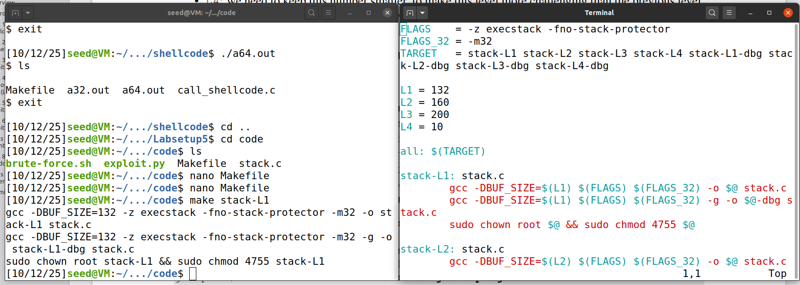

# Buffer-Overflow Attack Lab - Set-UID Version

## Question 1 — Tasks 1–3

### Task 1 — Invoking the Shellcode

In this task, we compiled ``call_shellcode.c`` with the provided Makefile and executed both the 32-bit and 64-bit binaries. Both binaries launched an interactive shell, and each shell started in the directory from which the program was executed.

### Task 2 — Understanding the Vulnerable Program

We initially studied the code of the program with a buffer overflow vulnerability. We noticed an attempt to copy a character array that can be up to 517 bytes into a buffer with a maximum size of 100 bytes. Since strcpy doesn't check buffer bounds, an overflow eventually occurs.

We then changed the variable L1 present on the Makefile to 132 (100 + 4 * 8(G)) and then compiled the program with ``make stack-L1`` which disabled StackGuard and protections against code execution invoked from the stack, changed the program's owner to root and enabled Set-UID.

