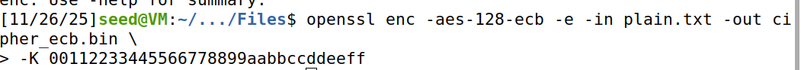
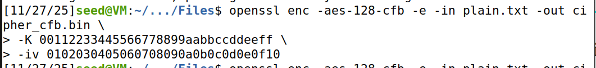
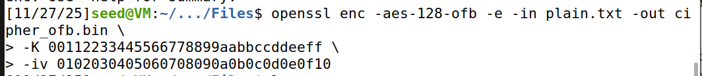
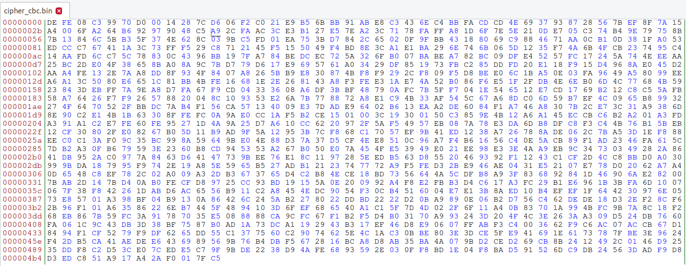
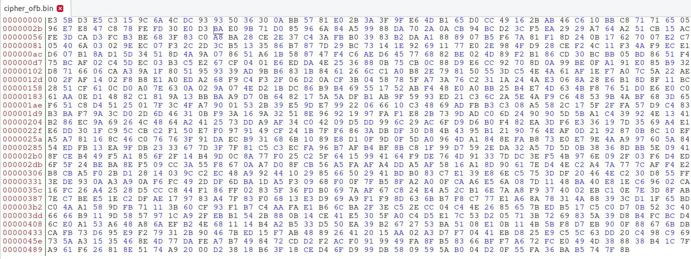
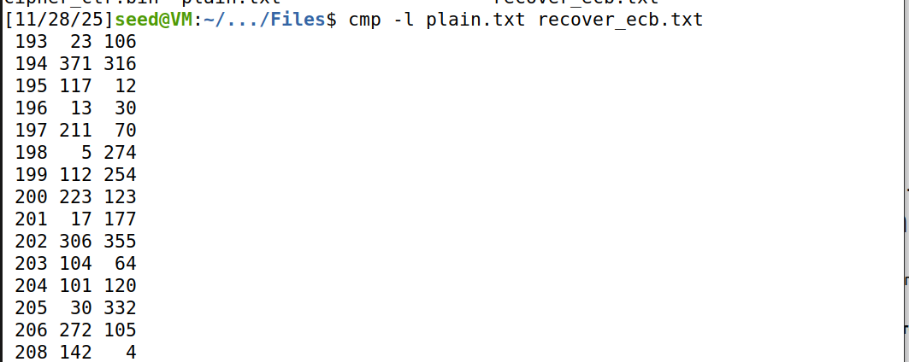
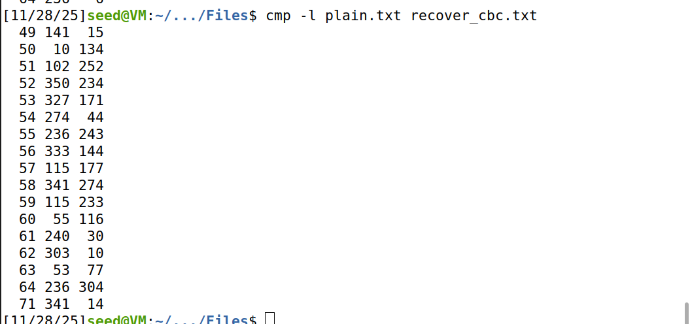
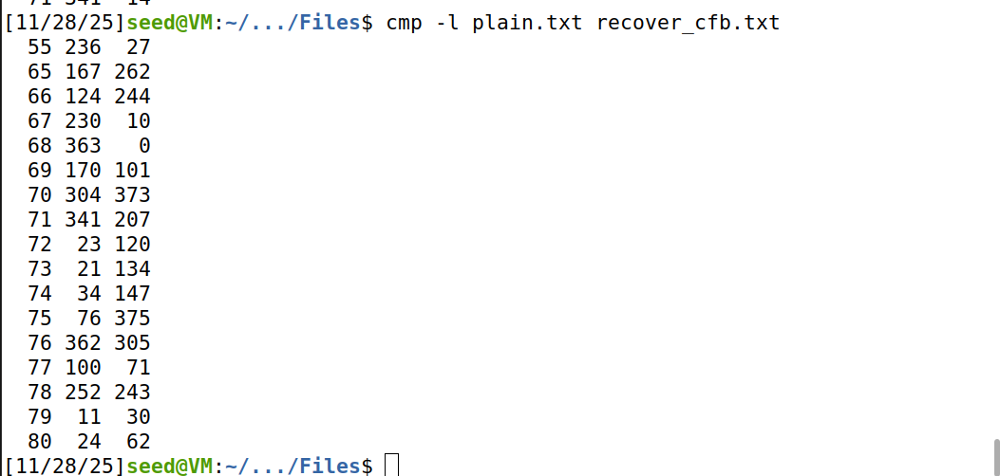
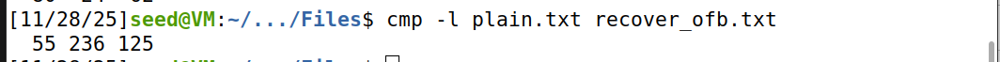

# Secret-Key Encryption

## Task 1- Frequency Analysis

### **1. Task Description**

In this task, we are given a ciphertext that was produced using a **monoalphabetic substitution cipher**.
The goal was to **recover the full plaintext** and **determine the substitution key** by applying **frequency analysis** and manual pattern recognition.

We are told that:

* All letters were converted to lowercase.
* All punctuation and digits were removed.
* Spaces were kept to simplify the task.
* A randomized permutation of the alphabet was used as the encryption key.
* The encryption was performed using:

```
tr 'abcdefghijklmnopqrstuvwxyz' '<random_permutation>' < plaintext.txt > ciphertext.txt
```

We are also provided with a Python tool `freq.py`, which outputs frequency statistics from the ciphertext.
The given output was:

```
$ ./freq.py
-------------------------------------
1-gram (top 20):
n: 488
y: 373
v: 348
...
-------------------------------------
2-gram (top 20):
yt: 115
tn: 89
mu: 74
...
-------------------------------------
3-gram (top 20):
ytn: 78
vup: 30
mur: 20
...
```

Our task is to use these frequency patterns to infer the plaintext.

---

### **2. Methodology**

**Replace the incorrect paragraph with this corrected version**

Based on the 3-gram and 2-gram frequencies, I made initial assignments using the most common English trigrams and bigrams as anchors:
>
* The ciphertext trigram **ytn** (most frequent) strongly suggested **“the”**, so I assigned `y → t`, `t → h`, `n → e`.
* The bigrams **yt** and **tn** then became **th** and **he**, which confirmed the trigram hypothesis.
* Next, the frequent bigram **mu** suggested **“in”** (`m → i`, `u → n`).
* The trigram **vup** matched **“and”** (`v → a`, `p → d`) and **mur** matched **“ing”** (`r → g`).
  To test these hypotheses I applied partial substitutions with `tr` and inspected the result, using uppercase to mark confirmed plaintext letters. For example:

```
tr 'nytvupmr' 'ETHANDIG' < ciphertext.txt > partial.txt
```

This produced obvious words like **THE**, **AND**, **IN**, and **ING**, which provided strong context for discovering the remaining letters.


**Iterative Refinement**

As I identified more patterns and recognizable English words,
I gradually expanded the mapping.

Examples:

* “EkTRA” in partial plaintext clearly corresponds to **EXTRA**
  ⇒ ciphertext `k` → plaintext `X`

* “SEkUAL” corresponds to **SEXUAL**
  ⇒ confirms `k` → X, `s` → S, etc.

* “PRIwE” corresponds to **PRIZE**
  ⇒ ciphertext `w` → Z

Each discovery was added to the evolving translation table using new `tr` commands.

---

### **3. Final Key Recovery**

After completing the frequency-analysis process, the full substitution key was recovered.

**Cipher Alphabet → Plain Alphabet**

```
nytvupmrqhfecxbaidlgzjsokw 
ETHANDIGSRVPMOFCLYWBUQKJXZ
```

**Final Decryption Command**

```
tr 'nytvupmrqhfecxbaidlgzjsokw' 'ETHANDIGSRVPMOFCLYWBUQKJXZ' < ciphertext.txt > partial.txt
```

This produced a **fully readable English article** discussing:

* The Oscars ceremony
* MeToo and Times Up
* Hollywood awards-season politics
* Statistical details of Oscar voting
* Predictions and controversies


---

## Task 2- Encryption using Different Cyphers and Models

In this task, I explored AES-128 encryption in three modes: **ECB**, **CBC**, and **CTR**. I generated a plaintext file with 1200 bytes and encrypted it with all three modes.

### **Step 1: Create the plaintext file**

I created a file named `plain.txt` with 1200 bytes using the following command:


This generates 1200 random bytes as input for encryption.

---

### **Step 2: Encrypt the file**

**AES-128-ECB**


**Note:** ECB does not use an IV; only the key (`-K`) is required.

#### **AES-128-CBC**


**Note:** CBC requires both the key (`-K`) and IV (`-iv`).

**AES-128-CTR**


**Note:** CTR also requires the key and IV; it functions as a stream cipher.

---

### **Step 3: Decrypt the files**

**AES-128-ECB**


**AES-128-CBC**


**AES-128-CTR**


---

### **Step 4: Verify correctness**

I verified the decrypted files against the original using `diff`:


**Result:** No differences were reported. This confirms that encryption and decryption worked correctly for all three modes.

---

### **Step 5: Answering to the Questions**


**1. When encrypting, which flags did I need to specify?**

To encrypt using OpenSSL, I needed to use:

* `-e` — tells OpenSSL to **encrypt**
* `-in` — input file (plaintext.txt)
* `-out` — output encrypted file
* `-K` — AES key in hexadecimal (**required for all modes**)
* `-iv` — **required only for AES-128-CBC and AES-128-CTR**
  (AES-128-ECB does *not* use an IV)

---

**2. What is the difference between the AES-128-ECB, AES-128-CBC, and AES-128-CTR modes?**

* **AES-128-ECB**
  Encrypts each 16-byte block independently; **no IV** is used.
  Patterns in the plaintext remain visible in the ciphertext.

* **AES-128-CBC**
  Each block is XORed with the previous ciphertext block; uses an **IV** for the first block.
  More secure than ECB but error propagation occurs.

* **AES-128-CTR**
  Converts AES into a **stream cipher**: encrypts a counter combined with an IV.
  No padding required, blocks can be processed independently.

---

**3. When decrypting, which flags did I need to specify?**

For decryption, the required flags were:

* `-d` — tells OpenSSL to **decrypt**
* `-in` — encrypted input file
* `-out` — output plaintext file
* `-K` — same key used during encryption
* `-iv` — **needed for CBC and CTR**, not used in ECB

---

**4. What is the main difference between AES-128-CTR and the other modes?**

The key difference of **AES-128-CTR** is that it operates as a stream cipher, not a block cipher mode. But there are other differences, such as:
* No padding is used
* Encryption and decryption are essentially the same operation
* A change in one byte only affects that byte
* Blocks can be processed in parallel

In contrast, **AES-128-ECB and AES-128-CBC** are **block-based modes**, require padding, and operate strictly on 16-byte blocks.

### **Step 6 : Summary Table**

| Mode    | Encryption Flags     | Decryption Flags     | IV Required? | Notes                                            |
| ------- | -------------------- | -------------------- | ------------ | ------------------------------------------------ |
| **ECB** | `-e -in -out -K`     | `-d -in -out -K`     | ❌ No         | Blocks independent, patterns visible             |
| **CBC** | `-e -in -out -K -iv` | `-d -in -out -K -iv` | ✔ Yes        | Blocks chained, errors propagate                 |
| **CTR** | `-e -in -out -K -iv` | `-d -in -out -K -iv` | ✔ Yes        | Stream cipher, no padding, byte-level encryption |

**Key takeaway:** AES-128-CTR behaves differently from ECB and CBC because it is stream-based, not block-based, allowing flexible and parallel processing.

## Task 5- Error Propagation- Corrupted Cypher Text

### **1. Introduction**

In this task, the objective was to analyze how different AES encryption modes behave when the ciphertext is partially corrupted.
Using the previously generated `plain.txt` file (≈1200 bytes), I encrypted it using several AES-128 modes and then manually corrupted **byte 55** of each ciphertext using the **Bless hex editor**.

After corrupting the ciphertext, I decrypted it using the correct key and IV and compared the results with the original plaintext to measure how much information was lost.

The AES modes tested:

* **AES-128-ECB**
* **AES-128-CBC**
* **AES-128-CFB**
* **AES-128-OFB**

Because AES works on **16-byte blocks**, error propagation depends heavily on the mode.

---

## **2. Preliminary Block Calculation**

The corrupted byte was the **55th byte** of the ciphertext.
AES uses 16-byte blocks, so:

[
\text{Block index} = \left\lfloor \frac{55 - 1}{16} \right\rfloor
= \left\lfloor \frac{54}{16} \right\rfloor = 3
]

Thus:

* The corrupted byte belongs to **Block 3** (0-based indexing)
* That block covers plaintext offsets **48–63**

This is essential for understanding how corruption propagates.

---

## **3. Expected Behavior (Before Conducting Experiments)**

Below are the theoretical predictions **before modifying the ciphertext**.

---

### **3.1 AES-128-ECB — Block Independent**

**Prediction:**
Only the corrupted block becomes unreadable.

* A single corrupted byte in ciphertext block *C₃* destroys only plaintext block *P₃*.
* No propagation.

**Expected information loss:**
➡️ **16 bytes**

---

### **3.2 AES-128-CBC — Chained Blocks**

**Prediction:**
Two kinds of corruption:

1. **Block 3 (48–63): fully corrupted**
   Because `Dec(C₃)` becomes random.

2. **Block 4 (64–79): exactly one byte corrupted**
   Because corrupted `C₃` is XORed during CBC decryption.

**Expected information loss:**
➡️ **16 bytes destroyed + 1 byte with bit flipped**

---

### **3.3 AES-128-CFB — Feedback Propagates Error**

**Prediction:**

* In block 3: only **one byte** becomes corrupted (bit flip).
* In block 4: **entire block becomes corrupted** (bad ciphertext fed into keystream).

**Expected information loss:**
➡️ **1 byte partially corrupted + 16 bytes fully corrupted**

---

### **3.4 AES-128-OFB — Stream Cipher Mode**

**Prediction:**

* Only **one byte** is corrupted.
* No propagation.

Because ciphertext bits are XORed with a keystream independent of ciphertext.

**Expected information loss:**
➡️ **1 byte**

---

## **4. Experimental Procedure**

1. Encrypted the 1200-byte file using all AES modes.
   Example image placeholder:







2. Opened each ciphertext using **Bless**.






3. Modified the byte at position **55** by flipping a bit.
4. Decrypted all corrupted ciphertext files.
5. Compared them using `cmp`, `diff`, and `hexdump`.

---

## **5. Experimental Results**

The results matched the theoretical predictions perfectly.

---

### **ECB – Only One Block Lost**

* Block 48–63 was corrupted.
* All other bytes were correct.



---

### **CBC – One Full Block + 1 Byte**

* Block 48–63: fully corrupted
* Block 64–79: exactly **one byte** corrupted
* Remaining data correct
  



---

### **CFB – One Byte + One Full Block**

* One byte corrupted in block 48–63
* Block 64–79 entirely corrupted




---

### **OFB – Only One Byte Affected**

* Only byte 55 incorrect
* Everything else identical to original




---

## **6. Summary Table**

| AES Mode | Fully Lost Data | Partially Corrupted Data | Error Propagation                     |
| -------- | --------------- | ------------------------ | ------------------------------------- |
| **ECB**  | 16 bytes        | 0 bytes                  | Only the affected block               |
| **CBC**  | 16 bytes        | 1 byte                   | One block + one byte in next block    |
| **CFB**  | 16 bytes        | 1 byte                   | One byte + next block fully corrupted |
| **OFB**  | 0 bytes         | 1 byte                   | No propagation                        |

---

## **7. Conclusion**

This task demonstrated how error propagation differs significantly among AES modes:

* **ECB** has no chaining → corruption limited to one block.
* **CBC** chains blocks → destroys one block and corrupts 1 byte in the next block.
* **CFB** feeds ciphertext into the keystream → corrupts one byte and the entire next block.
* **OFB** behaves like a synchronous stream cipher → only one byte is affected.

In the end, the results matched, confirming the previsions made in the begining.


